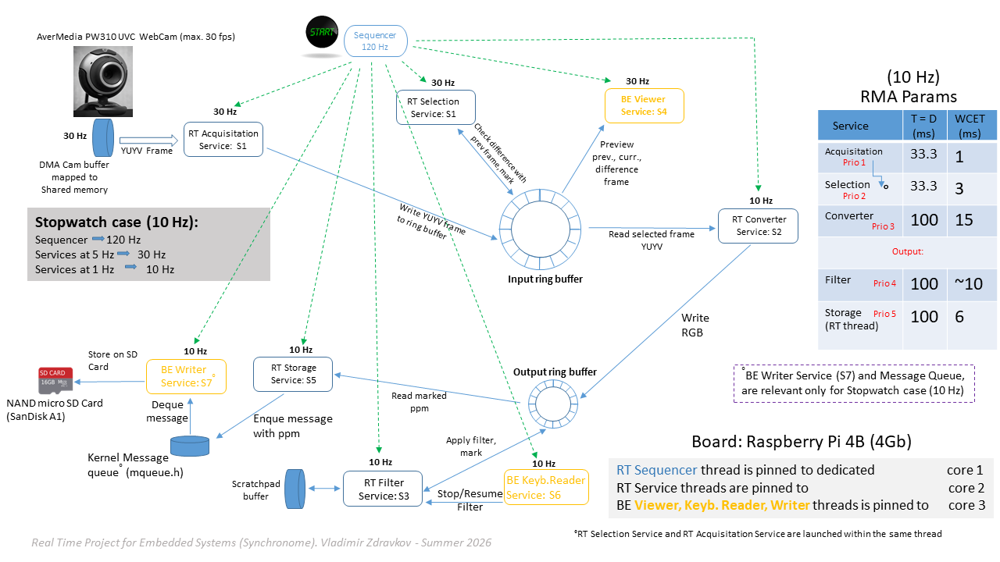

# RTES-Synchronome
University Boulder Real Time Systems - Synchronome
<p align="center">
  
</p>

---

## Overview

This project captures video frames from a V4L2 USB camera at 10 Hz, detects the current angular position of a synchronome pendulum clock from each frame, and saves the selected frames as timestamped PPM files. The pipeline is structured as a real-time cyclic executive running on a Raspberry Pi 4 with an RT-preempt kernel.

The implementation is split across two files:

| File | Responsibility |
|---|---|
| `seqv4l2.c` | Sequencer, service thread lifecycle, startup/shutdown orchestration |
| `capturelib.c` | V4L2 camera driver interface, ring buffers, frame pipeline functions, POSIX mqueue |

---

## CPU Core Assignment

The application pins each thread to a specific CPU core to isolate real-time work from OS and I/O interference:

| Core | Role | Threads |
|---|---|---|
| CPU 0 | OS / background | kernel, IRQs |
| CPU 1 (`SEQ_CORE`) | Sequencer | `main()` / SIGALRM handler |
| CPU 2 (`RT_CORE`) | Real-time pipeline | S1, S2, S3, S5 |
| CPU 3 (`VIEWER_CORE`) | Non-RT I/O | S6 (keyboard), S7 (file writer) |

---

## seqv4l2.c — Sequencer and Service Threads

### Startup sequence (`main`)

1. Sets all CPU cores to the `performance` frequency governor and writes `0` to `/dev/cpu_dma_latency` to prevent the CPU from entering deep idle states.
2. Calls `v4l2_frame_acquisition_initialization()` — opens the POSIX mqueue and initialises the V4L2 camera device.
3. Locks all process memory with `mlockall(MCL_CURRENT | MCL_FUTURE)` to eliminate page-fault latency.
4. Primes the camera with one `seq_frame_read()` call so the V4L2 buffer queue is warmed before the sequencer starts.
5. Initialises POSIX semaphores `semS1`–`semS6` (all start at zero — threads block immediately on creation).
6. Elevates `main` to `SCHED_FIFO` max priority and pins it to `SEQ_CORE`.
7. Creates service threads S1–S5 (`SCHED_FIFO`, `RT_CORE`), S6 and S7 (`SCHED_OTHER`, `VIEWER_CORE`).
8. Arms a POSIX interval timer at **120 Hz** (8.333 ms) that delivers `SIGALRM` to the main thread, invoking the `Sequencer` handler.

### Sequencer (120 Hz, SIGALRM handler)

The Sequencer is the cyclic executive. It increments `seqCnt` on every tick and releases service threads at integer sub-rates by calling `sem_post`:

| Service | Rate | Release condition |
|---|---|---|
| S1 — frame acquisition | 30 Hz | `seqCnt % 4 == 0` |
| S2 — frame processing | 10 Hz | `seqCnt % 12 == 0` |
| S3 — frame filtering | 10 Hz | `seqCnt % 12 == 0` |
| S5 — frame storage | 10 Hz | `seqCnt % 12 == 0` |
| S6 — keyboard | 10 Hz | `seqCnt % 12 == 0` |

When `abortTest` is set (by S1 after 9100 acquisitions, or by 'q' key press), the Sequencer disarms the interval timer, sets the `abortS1`–`abortS5` flags, and unblocks every service semaphore once so each thread can observe its abort flag and exit.

### Service threads

**S1 — Frame Acquisition (SCHED_FIFO RT\_MAX-1, 30 Hz)**
Calls `seq_frame_read()`. Dequeues one V4L2 MMAP buffer, copies the YUYV frame into the input ring buffer at the detected head index, and re-queues the buffer back to the driver.

**S2 — Frame Processing (SCHED_FIFO RT\_MAX-2, 10 Hz)**
Calls `seq_frame_process()`. Converts the current input ring buffer slot from YUYV to RGB24 and writes it into the output ring buffer, marking the slot `is_ready_to_save`.

**S3 — Frame Filtering (SCHED_FIFO RT\_MAX-3, 10 Hz)**
Calls `seq_frame_filter()`. Applies an image filter to the RGB24 frame in the output ring buffer and sets `is_filter_applied`.

**S4 — Live Viewer (SCHED\_OTHER, VIEWER\_CORE, disabled)**
Compiled out by default (`VIEWER_ENABLE 0`). When enabled, uses SDL2 to display the current frame, previous frame, and amplified frame difference side-by-side.

**S5 — Frame Storage (SCHED_FIFO RT\_MAX-4, 10 Hz)**
Calls `seq_frame_store()`. Takes a fully processed and filtered output ring slot, allocates a heap buffer, copies the RGB24 frame into it, and sends a `frame_msg` pointer through the POSIX mqueue to S7. Non-blocking: drops the frame if the queue is full.

**S6 — Keyboard Reader (SCHED\_OTHER, VIEWER\_CORE)**
Reads single keypresses in raw terminal mode. `q` sets `abortTest`. `s`/`r` toggle the filter-skip flag via `SIGRTMIN+1` real-time signal to the main thread.

**S7 — File Writer (SCHED\_OTHER, VIEWER\_CORE)**
Loops on `seq_frame_write()`. Each call blocks on `mq_receive` until a message arrives, writes the frame to a PPM file, and frees the heap buffer. Exits when it receives a sentinel message (`data == NULL`).

### Shutdown sequence

1. `abortTest` becomes true → Sequencer fires one last time, disarms timer, unblocks S1–S6.
2. `main` joins all RT service threads (S1–S5).
3. `main` calls `seq_write_shutdown()` — sends a sentinel `frame_msg` (data=NULL) through the mqueue. Because all RT threads have already exited, no more real frames can be sent, so the sentinel is guaranteed to arrive after all frame messages.
4. S7 receives the sentinel, exits its loop, and `main` joins it.
5. `main` calls `v4l2_frame_acquisition_shutdown()`, which stops the camera, closes the V4L2 device, closes and unlinks the mqueue, and restores the saved `msg_max`.

---

## capturelib.c — Capture Pipeline

### V4L2 device initialisation

- Opens `/dev/video0` and requests **6 MMAP buffers** (`DRIVER_MMAP_BUFFERS`) from the kernel. The extra buffers absorb camera capture jitter without stalling S1.
- Disables autofocus via `VIDIOC_S_CTRL` to eliminate focus-hunt latency spikes.
- Configures the format to **YUYV 4:2:2 at 640×480**.
- Queues all MMAP buffers and starts streaming with `VIDIOC_STREAMON`.

### Data structures

```
Camera → V4L2 MMAP buffers (kernel, 6 slots)
              │
              ▼ S1: seq_frame_read
        ring_buffer (YUYV, 30 slots)        ← input ring buffer
              │
              ▼ S2: seq_frame_process
        ring_output_buffer (RGB24, 30 slots) ← output ring buffer
              │
              ▼ S5: seq_frame_store
        POSIX mqueue /capture_frames         ← heap pointers, 30 messages
              │
              ▼ S7: seq_frame_write
        frames/Time-NNNN.ppm                 ← PPM files on disk
```

Both ring buffers have **30 slots** (`FRAMES_PER_ACQ_PERIOD × FRAMES_PER_SEC = 3 × 10`). Slots cycle using a head/tail index; the head advances as S5 consumes frames.

### seq_frame_read — head index detection

The input ring buffer has one slot per clock position. S1 does not simply write to the next slot in sequence — it identifies **which slot corresponds to the current pendulum position** by comparing the incoming frame against each slot using a luminance-difference metric (`frame_diff_yuyv`, `frame_diff_rgb`).

A slot is selected when its difference percentage falls between `DIFF_MIN` (0.7) and `DIFF_MAX` (0.94) — values calibrated experimentally for the synchronome clock face. This is how the system tracks the clock's angular position rather than just recording frames blindly.

### seq_frame_process — YUYV → RGB24

Takes the selected YUYV frame and converts it to RGB24 for downstream processing and saving. Writes the result into `ring_output_buffer` and marks `is_ready_to_save = true`.

### seq_frame_filter — image filter

Applies `apply_filter()` to the RGB24 frame in the output ring buffer and sets `is_filter_applied = true`. Skippable at runtime via the 's'/'r' keyboard commands.

### seq_frame_store — mqueue producer (S5, RT\_CORE)

```
malloc(921 600 bytes)
memcpy from output ring slot → heap buffer
mq_timedsend({0,0}, ...)    ← zero absolute timeout = non-blocking
```

Using `mq_timedsend` with an absolute timeout of `{0, 0}` (Unix epoch — always in the past) gives non-blocking behaviour without opening the descriptor with `O_NONBLOCK`. If the mqueue is full, the call returns `ETIMEDOUT` immediately, the heap buffer is freed, and the frame is logged as dropped. The output ring slot is released for reuse immediately after a successful send.

### seq_frame_write — mqueue consumer (S7, VIEWER\_CORE)

```
mq_receive(...)  ← blocks until a message arrives
if msg.data == NULL → return 0  (sentinel, S7 exits)
dump_ppm(msg.data, ...)
free(msg.data)
return msg.tag
```

Blocking `mq_receive` eliminates the need for a separate semaphore to wake S7. The POSIX mqueue FIFO ordering guarantees the sentinel arrives only after all real frame messages have been processed.

### POSIX mqueue (`/capture_frames`)

| Property | Value |
|---|---|
| Name | `/capture_frames` |
| Depth | 30 messages (`FRAME_MQ_DEPTH = RING_OUTPUT_BUFFER_SIZE`) |
| Message size | `sizeof(struct frame_msg)` ≈ 28 bytes |
| Payload | heap pointer + frame tag + timestamp |
| Producer send | `mq_timedsend` with zero timeout (non-blocking, drops on full) |
| Consumer receive | `mq_receive` (blocking) |
| Shutdown signal | sentinel: `frame_msg.data == NULL` |

Only the pointer travels through the queue — the 921 KB frame data remains on the heap. This eliminates the per-frame copy that a static ring-buffer approach would require, at the cost of one `malloc`/`free` pair per frame on the RT thread S5.

`seq_write_init()` raises `/proc/sys/fs/mqueue/msg_max` to `FRAME_MQ_DEPTH` if the system default is lower (requires root, which is already needed for `SCHED_FIFO`), and saves the original value. `seq_write_cleanup()` closes and unlinks the queue and restores `msg_max`.

---

## Key Configuration Constants (`capturelib.c`)

| Constant | Value | Meaning |
|---|---|---|
| `HRES` / `VRES` | 640 / 480 | Capture resolution |
| `FRAMES_PER_SEC` | 10 | Target output frame rate |
| `FRAMES_PER_ACQ_PERIOD` | 3 | Ring buffer slots per second |
| `DRIVER_MMAP_BUFFERS` | 6 | V4L2 kernel buffers |
| `DIFF_MIN` / `DIFF_MAX` | 0.70 / 0.94 | Frame-difference thresholds for head detection |
| `CAPTURE_FRAMES` | 301 | Number of frames to save before auto-shutdown |
| `FRAME_MQ_DEPTH` | 30 | POSIX mqueue capacity |

---

## Build

```bash
make seqv4l2
```

Requires: `gcc`, `libpthread`, `librt`, V4L2 kernel headers. Run as root (needed for `SCHED_FIFO` and `msg_max` elevation).

```bash
sudo ./seqv4l2
```

Saved frames appear in `frames/Time-NNNN.ppm`.
