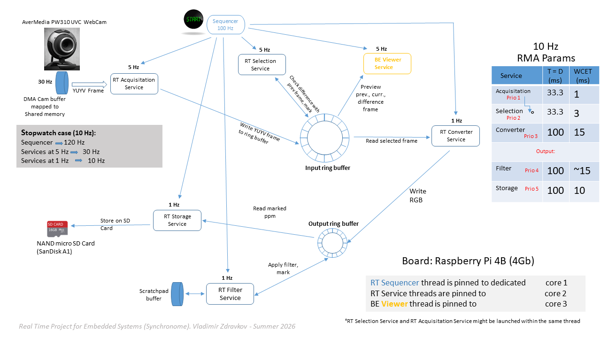
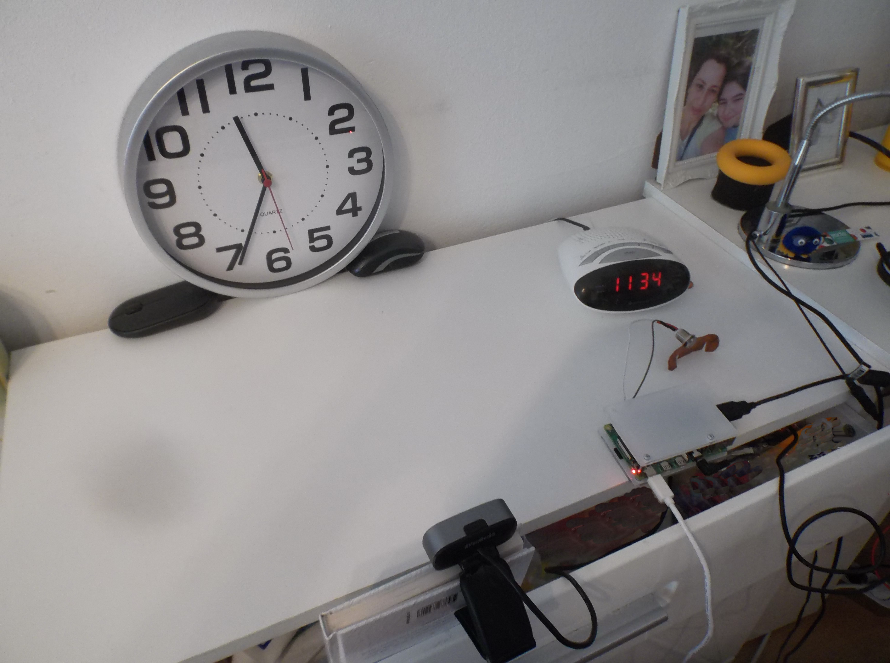

# RTES-Synchronome
University of Colorado Boulder — Real Time Embedded Systems — Synchronome Project

<p align="center">
  
</p>

## Hardware
<p align="center">
  
</p>

---

## Overview

The Synchronome captures one frame per second from an analogue wall clock using a UVC webcam, always selecting the frame where the second hand has just settled — not blurred mid-swing. It runs as a multi-threaded real-time application on a Raspberry Pi 4 using Linux with the PREEMPT_RT patch.

The two source files divide responsibility cleanly:

| File | Role |
|---|---|
| `seqv4l2.c` | Cyclic-executive sequencer, thread lifecycle, RT policy, SDL2 viewer |
| `capturelib.c` | V4L2 driver interface, ring buffers, phase-alignment logic, image pipeline |

---

## `seqv4l2.c` — Sequencer and Service Threads

### System Preparation

Before any threads are created the main thread performs three system-level steps that are prerequisites for deterministic latency:

1. **CPU frequency governor** — calls `set_cpu_governor("performance")`, writing `performance` to every `/sys/devices/system/cpu/cpu*/cpufreq/scaling_governor` sysfs node. This prevents frequency scaling from introducing variable instruction throughput.
2. **Deep-idle suppression** — opens `/dev/cpu_dma_latency` and writes `0` (zero microseconds). The kernel honours this as a constraint on the C-state depth of every CPU while the file descriptor stays open. The fd is kept in a `static` variable so the constraint lives for the lifetime of the process.
3. **Memory locking** — calls `mlockall(MCL_CURRENT | MCL_FUTURE)`. Combined with `stack_prefault()` (touching 16 KB of stack depth before the first semaphore wait), this eliminates minor page faults from the RT execution path.

Syslog is opened with facility `LOG_LOCAL1` to keep RT log messages separate from the system journal.

### CPU Affinity Layout

Three CPU cores are used with explicit `pthread_attr_setaffinity_np` / `sched_setaffinity` assignments:

| Core | Constant | Users |
|---|---|---|
| 1 | `SEQ_CORE` | Sequencer (main thread) |
| 2 | `RT_CORE` | Service_1 … Service_5 (all RT capture/process threads) |
| 3 | `VIEWER_CORE` | Service_4 (SDL2 viewer), Service_6 (keyboard reader) |

Isolating the SDL2 viewer on its own core prevents display-driver stalls (vsync waits, GPU uploads) from preempting the RT capture pipeline on core 2.

### POSIX Interval Timer — the Sequencer

The sequencer uses `timer_create(CLOCK_MONOTONIC, …)` with `SIGEV_THREAD_ID` directed at the main thread's TID. This means `SIGALRM` is delivered exclusively to the main thread, not to any service thread. The main thread runs at `SCHED_FIFO` `RT_MAX` priority so that the signal handler preempts any lower-priority thread that happens to be running on core 1.

The timer period is **10 ms**, giving a **100 Hz** base tick. All service rates are integer sub-divisors:

```
itime.it_interval.tv_nsec = 10 000 000   // 10 ms → 100 Hz
```

The `Sequencer()` signal handler increments `seqCnt` and posts semaphores according to the following schedule:

| Service | Condition | Rate |
|---|---|---|
| Service_1 — frame acquisition | `seqCnt % 20 == 0` | **5 Hz** |
| Service_2 — frame process | `seqCnt % 100 == 0` | **1 Hz** |
| Service_3 — frame filter | `seqCnt % 100 == 0` | **1 Hz** |
| Service_4 — viewer display | `seqCnt % 20 == 0` | **5 Hz** |
| Service_5 — frame storage | `seqCnt % 100 == 0` | **1 Hz** |
| Service_6 — keyboard | `seqCnt % 100 == 0` | **1 Hz** |

### Thread Priorities (SCHED_FIFO, core 2)

Priorities follow Rate-Monotonic order — highest rate gets highest priority:

| Thread | Policy | Priority | Rate |
|---|---|---|---|
| Sequencer (main) | SCHED_FIFO | RT_MAX | 100 Hz |
| Service_1 | SCHED_FIFO | RT_MAX − 1 | 5 Hz |
| Service_2 | SCHED_FIFO | RT_MAX − 2 | 1 Hz |
| Service_3 | SCHED_FIFO | RT_MAX − 3 | 1 Hz |
| Service_5 | SCHED_FIFO | RT_MAX − 4 | 1 Hz |
| Service_4 | SCHED_OTHER | 0 | 5 Hz |
| Service_6 | SCHED_OTHER | 0 | 1 Hz |

### Clocks

`CLOCK_MONOTONIC_RAW` is used for all elapsed-time measurements (`MY_CLOCK_TYPE`). It is not subject to NTP or `adjtime()` slew, making it the most stable choice for jitter measurement. The POSIX interval timer itself must use `CLOCK_MONOTONIC` (the adjustable variant) because `timer_create` requires it.

### Abort and Termination

The run is bounded by frame counts that each service thread checks independently:

- Service_1 aborts when `S1Cnt > 9100` (≈ 1820 seconds of 5 Hz acquisition, providing headroom beyond the 1801-frame capture goal).
- Service_3 aborts when `filter_framecnt == 1802`.
- Service_5 aborts when `store_cnt == 1801`.

Any service sets `abortTest = TRUE`. On the next `Sequencer` tick, the handler detects the flag, arms the timer to zero (disabling it), sets `abortS1` … `abortS5`, and posts all semaphores once so blocked threads can check their abort flags and exit cleanly.

### Keyboard Handling — Service_6

Service_6 puts stdin into raw, non-canonical mode (`ICANON | ECHO` cleared, `VMIN=0`, `VTIME=0`) and polls with `select()` on a 1-second timeout. When a key arrives:

- `'s'` / `'S'` — sends `SIGRTMIN+1` to the process via `sigqueue()` with `sival_int = 's'`. The registered `skip_filter_handler` sets the `atomic_int skip_filter_requested = 1`. Service_3 checks this flag each activation and skips the Laplacian pass when set.
- `'r'` / `'R'` — same mechanism, resets `skip_filter_requested = 0`.

All other keys are silently ignored. Terminal settings are restored before the thread exits.

### SDL2 Live Viewer — Service_4

Service_4 is a `SCHED_OTHER` thread on core 3. It opens three side-by-side SDL2 windows:

| Window | Content |
|---|---|
| Current Frame | Latest YUYV frame converted to RGB24 |
| Previous Frame | Frame immediately before current |
| Diff (×4) | Per-channel absolute difference, pixel brightness multiplied by `VIEWER_DIFF_AMPLIFY = 4` |

On each 5 Hz activation the thread drains any queued semaphore posts with `sem_trywait` before rendering, ensuring it always displays the most recent frame rather than falling behind. Window titles show frame number, `[MOTION]` and `[SAVED]` annotations, and the current inter-frame diff percentage. `SDL_QUIT` or the Escape key triggers `abortTest`.

---

## `capturelib.c` — V4L2 Interface and Image Pipeline

### Camera Initialisation

`v4l2_frame_acquisition_initialization()` configures `/dev/video0` for:

- Resolution: **640 × 480**
- Pixel format: **YUYV** (YUV 4:2:2, 2 bytes/pixel)
- **6 kernel mmap DMA buffers** (`DRIVER_MMAP_BUFFERS`), which allows the driver to queue ahead and prevents frame drops even under brief scheduling latency.

After initialisation the stream is started with `VIDIOC_STREAMON` before any service thread runs.

### Ring Buffer Architecture

Two independent ring buffers decouple the pipeline stages:

**Input ring buffer** (`ring_buffer`, 5 slots of raw YUYV):

```
Slot size: 640 × 480 × 2 = 614 400 bytes (YUYV)
Slots    : ACQ_FRAMES_STORED_PER_FPS × FRAMES_PER_SEC = 5 × 1 = 5
```

Service_1 writes raw YUYV frames here at 5 Hz. Service_2 reads the selected head slot at 1 Hz.

**Output ring buffer** (`ring_output_buffer`, 4 slots of RGB24):

```
Slot size: 640 × 480 × 2 × 3 = 1 843 200 bytes (upsized for RGB24)
Slots    : FRAMES_PER_SEC + 3 = 4
```

Service_2 writes converted RGB24 frames here. Service_3 applies the sharpening filter in-place. Service_5 saves to disk. Each slot carries two flags (`is_ready_to_save`, `is_filter_applied`) that enforce the Service_2 → Service_3 → Service_5 ordering dependency.

A `scratchpad_buffer` (`MAX_HRES × MAX_VRES × 3 = 5 529 600 bytes`) serves as a read-only copy during the Laplacian filter pass and as the intermediate buffer for the legacy sequential path.

### Startup Sequence

```
Frames -30 … -16   Camera auto-exposure / focus settling (STARTUP_FRAMES = 30, skipped)
Frame  -15          Autofocus disabled via VIDIOC_S_CTRL(V4L2_CID_FOCUS_AUTO = 0),
                    focus position read back and locked with VIDIOC_S_CTRL(V4L2_CID_FOCUS_ABSOLUTE)
Frames -9 … -5     Phase-1 diff measurement window
Frame  -4           Gap — diff accumulators reset
Frames -3 …  0     Phase-2 diff measurement window
Frame  +1           Capture begins; selected startup head_idx is logged
```

### Phase-Alignment Logic — Finding the Settled Frame

This is the central algorithmic contribution of the project. The wall clock second hand moves once per second. Service_1 acquires at 5 Hz, so within each 1-second capture window the ring buffer holds 5 candidate frames at positions 0–4. The goal is to lock onto the slot that consistently captures the second hand after it has finished moving — not mid-swing.

**Inter-frame difference metric**

`frame_diff_yuyv()` computes the sum of absolute Y-channel differences across all pixels:

```c
diffsum = Σ |curr[i*2] - prev[i*2]|    // even bytes = Y luma channel
```

`frame_percent_diff()` normalises to `(diffsum / (width × height × 255)) × 100.0`.

A frame pair is classified as a "second-hand tick event" when the percentage falls in the empirically determined window `[DIFF_MIN = 0.46 %, DIFF_MAX = 0.65 %]`. This range corresponds to the small but consistent luma change caused by the hand sweeping across the frame; values outside this range indicate either a static scene (too low) or extraneous motion (too high).

**`compute_head_idx()` — pattern analysis**

Called with a 4-slot difference array and a count of how many slots fired, this function returns the ring-buffer index (0–3) that most likely represents the frame immediately after the tick:

- `count == 1`: single firing → head is determined directly from which slot fired.
- `count == 2`: two adjacent firings → the slot with the larger diff is the tick boundary.
- `count == 3`: three firings → the slot that dominates the other two by more than threshold `0.06 %` wins; otherwise the fallback is returned.
- `count == 0` or unresolved: falls back to the caller-supplied default.

**Two-phase startup**

The startup diff measurement is performed twice over non-overlapping windows (frames -9 to -5, then -3 to 0) to obtain `first_startup_head_idx` and `second_startup_head_idx`. The second result is preferred (`sel_startup_head_idx = second != UINT_MAX ? second : first`), giving the algorithm a chance to self-correct if the first window captured an ambiguous tick.

If both phases produce `UINT_MAX` (no tick detected by frame +30), the frame is declared unsafe and `seq_frame_read()` returns `INT_MIN`, causing Service_1 to signal `abortTest`.

**Steady-state tracking**

After startup, every complete 5-frame period (detected when `curr_frame_idx == ring_size - 1`) the diff data for that period is fed to `compute_head_idx()`. The result is compared to `pending_capture_head_idx`:

- If the same index appears for `CAPTURE_HEAD_STABILITY_PERIODS = 3` consecutive periods it is promoted to `capture_head_idx`.
- A transition from the previous stable index to a new one is held off for 4 consecutive ticks (`header_idx_delay_counter`) before the new index is adopted, dampening single-period glitches caused by reflections or lighting transients.

### Image Pipeline

#### Service_1 — `seq_frame_read()` @ 5 Hz

1. `select()` on the camera fd (2-second timeout).
2. `VIDIOC_DQBUF` — dequeues the next completed kernel DMA buffer.
3. `memcpy` to `ring_buffer.save_frame[tail_idx].frame` (614 400 bytes of raw YUYV).
4. Advances `tail_idx` modulo 5, increments `count`.
5. `VIDIOC_QBUF` — immediately re-queues the kernel buffer so the driver never stalls.
6. Computes inter-frame Y diff; sets `is_different_from_previous` on the current slot.
7. Sets `is_selected_to_save = true` on `ring_buffer.save_frame[head_idx]` (the phase-aligned slot), ready for Service_2 to consume.

#### Service_2 — `seq_frame_process()` @ 1 Hz

1. Reads YUYV from `ring_buffer.save_frame[head_idx]`.
2. Converts to RGB24 using integer BT.601:

```
c = Y − 16,  d = U − 128,  e = V − 128
R = clip((298·c + 409·e + 128) >> 8)
G = clip((298·c − 100·d − 208·e + 128) >> 8)
B = clip((298·c + 516·d + 128) >> 8)
```

Each YUYV macropixel `[Y0, U, Y1, V]` expands to two RGB triples, converting 2 bytes/pixel to 3 bytes/pixel.

3. Writes packed RGB24 to `ring_output_buffer.save_out_frame[tail_idx].frame`.
4. Sets `is_ready_to_save = true`, advances output `tail_idx`.
5. Clears `is_selected_to_save` on the input slot.

#### Service_3 — `seq_frame_filter()` @ 1 Hz

Applies a **3×3 Laplacian sharpening** kernel to the output ring buffer's head slot, provided `is_ready_to_save` is true and `is_filter_applied` is false:

```
Kernel:  [ 0  -1   0 ]
         [-1   5  -1 ]     output = 5·center − top − bottom − left − right
         [ 0  -1   0 ]
```

The original frame is first copied to `scratchpad_buffer` so that neighbour reads are never polluted by already-written output pixels. The operation is in-place on the output ring slot — no allocation. Border pixels retain their original values. Worst-case execution time on RPi4 @ 1.5 GHz is approximately 3–6 ms, well within the 1-second deadline.

After the pass, `is_filter_applied = true` is set. The pass is skipped entirely when `skip_filter_requested` is non-zero (toggled via keyboard).

#### Service_5 — `seq_frame_store()` @ 1 Hz

1. Checks both `is_ready_to_save && is_filter_applied` on `ring_output_buffer.save_out_frame[head_idx]`.
2. If both are set, calls `dump_ppm()`:
   - Opens `frames/Time-NNNN.ppm` (O_WRONLY | O_NONBLOCK | O_CREAT).
   - Writes a PPM P6 header with a `CLOCK_MONOTONIC` timestamp embedded as seconds + milliseconds.
   - Writes `width × height × 3` bytes of RGB24 pixel data.
3. Clears both flags, advances `ring_output_buffer.head_idx`.
4. Writes a syslog entry: `[COURSE #:4][Final Project][Frame Count: N][Image Capture Start Time: T seconds]`.
5. Terminates the run at `save_framecnt == 1801`.

### Frame Difference Utilities

| Function | Channels | Max diff denominator |
|---|---|---|
| `frame_diff_yuyv()` | Y only | `width × height × 255` |
| `frame_diff_yuyv_color()` | Y₀, U, Y₁, V | `width × height × 255 × 2` |
| `frame_percent_diff()` | configurable | normalises either of the above |

`frame_diff_yuyv_color()` is provided for future use; all phase-alignment decisions in the current 1 Hz build use the Y-only variant.

---

## Build and Run

```bash
make
sudo ./seqv4l2
```

Keyboard shortcuts during capture:

| Key | Effect |
|---|---|
| `s` / `S` | Skip Laplacian filter (Service_3 idles) |
| `r` / `R` | Resume Laplacian filter |
| `Esc` (SDL window) | Abort run |

Saved frames are written to `frames/Time-NNNN.ppm`.

Syslog output can be monitored with:

```bash
journalctl -f -t seqv4l2
# or, if /etc/rsyslog.conf routes local1 to a file:
tail -f /var/log/local1.log
```
